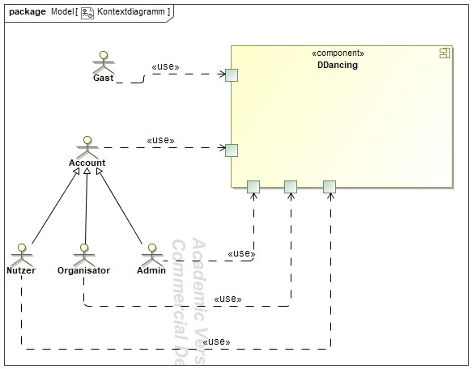
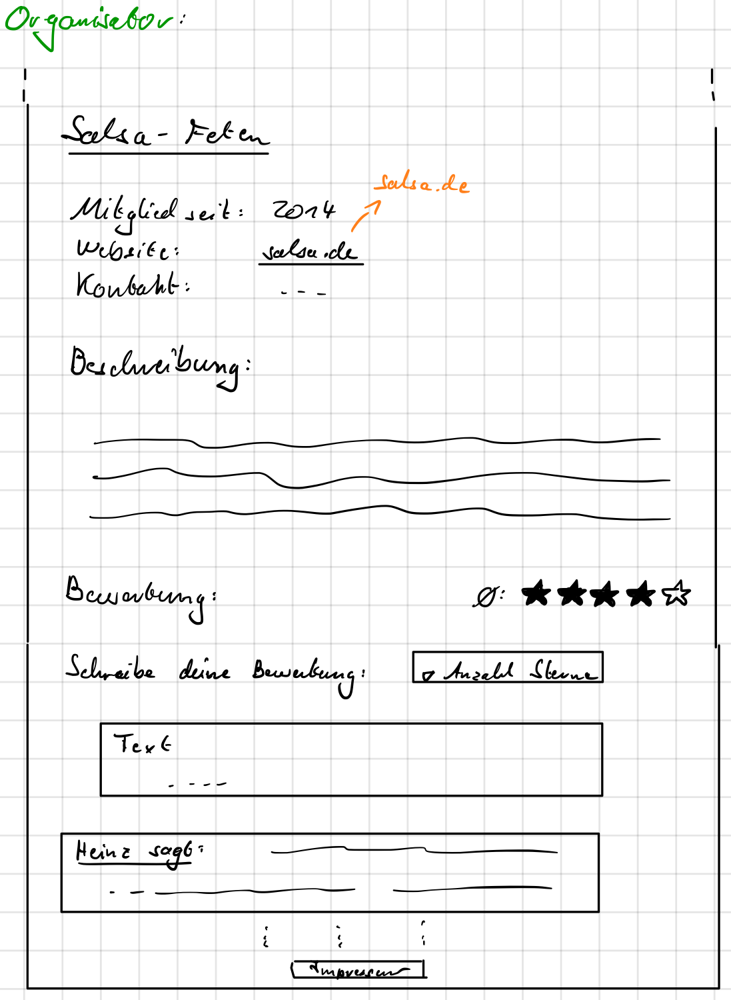
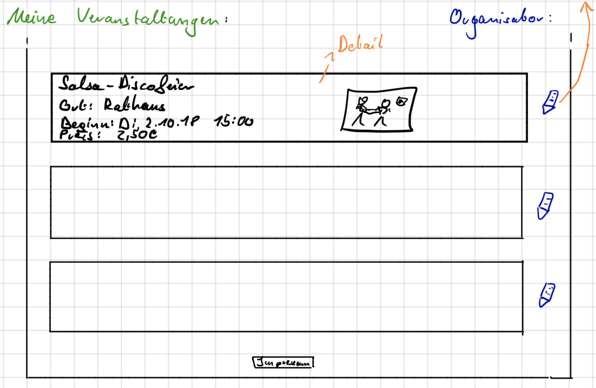

= Pflichtenheft
:project_name: Projektname
:icons: font
:source-highlighter: highlightjs
:toc: 
:numbered:
== __{project_name}__

[options="header"]
[cols="1, 1, 1, 1, 4"]
|===
|Version | Status      | Bearbeitungsdatum   | Autoren(en) |  Vermerk
|1.1     |Aktualisierung |07.12.2018| Julius Nestler|Überarbeitete Version während Implementierung
|1.0     |  Fertige Version  | 30.10.2018          | Julius Nestler | Vervollständigung des Pflichtenhefts, Meilenstein Analysephase
|0.5.1   | In Arbeit   | 26.10.2018          | Moritz Blei | Verschiedenste Korrekturen und Anmerkungen, Fragen zur Diskussion
|0.5     | In Arbeit   | 26.10.2018          | alle Teammitglieder | Einfügung AKD, Sequenzdiagramme, Korrekturlesen
|0.4     | In Arbeit   | 26.10.2018          | Karl Christian Lautenschläger, Julius Nestler, Adrian Schönnagel, Markus Kramer, Alexander Krause       |Überarbeitung, Entwurf fertig stellen
|0.3     | In Arbeit   | 19.10.2018          | Karl Christian Lautenschläger, Julius Nestler, Adrian Schönnagel, Markus Kramer, Alexander Krause       |Überarbeitung
|0.2     | In Arbeit   | 19.10.2018          | Karl Christian Lautenschläger, Julius Nestler, Adrian Schönnagel, Markus Kramer, Alexander Krause       |
|0.1     | In Arbeit   | 17.10.2018          | Julius Nestler, Karl Christian Lautenschläger       | Initiale Version
|===

[[Zusammenfassung]]
== Zusammenfassung

//Eine kurze Beschreibung des Dokuments. Wenige Absätze.
Bei diesem Dokument handelt es sich um das Pflichtenheft des Projekts "DDancing" . Im ersten Teil ist die Projektbeschreibung in Fließtext zu finden, darin finden sich alle Informationen über das Projekt in verbalisierter Form.
Im darauf folgenden Abschnitt werden die funktionalen und nicht-funktionalen Anforderungen an das Projekt formuliert. Dem folgt ein GUI Prototyp sowie eine Dialogskizzierung. Dem Datenmodell schließen sich noch ein Glossar und offene Punkte an.

== Aufgabenstellung und Zielsetzung
//Text aus Aufgabenstellung kopieren und ggfs. präzisieren.
//Insbesondere ergänzen, welche Ziele mit dem Abschluss des Projektes erreicht werden sollen.
Die Webapplikation beinhaltet auf der Startseite eine Kalenderansicht für alle Tanzveranstaltungen der Region Dresden.
Darunter verstehen sich Tanzbälle, Tanzabende, Tanzkurse und Tanzwettbewerbe. Im Kalender ist immer ein Monat zu sehen, es besteht aber die Möglichkeit, zwischen Monaten zu wechseln.
Von der Kalenderansicht kann zu einer Listenansicht der Veranstaltungen gewechselt werden.

Jeder Benutzer der Webapplikation kann die Veranstaltungsdetails zu jeder Veranstaltung einsehen. Durch Anklicken einer Veranstaltung im Kalender oder der Listenansicht wird die Detailansicht dieser geöffnet.
Diese Details beinhalten Ort, Zeit, Preis, die Art der Veranstaltung, die vertretenen Tanzstile und eine Verlinkung zu der Organisator-Detailseite. 
Auch gibt es Informationen darüber, ob die Musik live oder eingespielt ist. Auf der Startseite ist eine Filtermaske zu finden. Mit dieser können User Veranstaltungen nach diesen Kriterien hinsichtlich ihrer Vorlieben filtern und anzeigen lassen.
Es erfolgt eine Unterscheidung zwischen Wettbewerben, Kursen und Tanzabenden.

In den Organisatordetails sind Links zu den korrespondierenden Webseiten, eine kurze Beschreibung und weitere Kontaktmöglichkeiten zu finden, falls diese vorhandenn sind.
Dazu findet man für jeden Organisator Bewertungen.
Diese beinhalten einen Bewertungstext und die vergebene Beurteilung in Sternen. Alle Bewertungen sind nach ihrer Sternanzahl geordnet. So sind zum Beispiel alle drei-Sterne-Bewertungen in einem Feld lesbar. 
Dazu wird für jeden Organisator ein Bewertungsdurchschnitt errechnet und angezeigt.

Gäste der Webseite sind in der Lage, sich auf dieser zu registrieren und somit einen Account zu erstellen. Somit werden sie zu Nutzern. 
Eine Login-Funktion steht für alle nicht angemeldeten Besucher zur Verfügung. 
Eingeloggt können Nutzer zusätzlich Bewertungen abgeben und in der Accountverwaltung ihre Daten ändern.
Zudem gibt es für sie eine Tanzpartnerbörse. Auf dieser können sie ihr eigenes Profil veröffentlichen und die Profile anderer besichtigen.
Zu sehen sind: die Tanzerfahrung in Jahren, Alter, Körpergröße, E-Mail-Adresse und eine kurze Beschreibung der Person. Über eine Filterfunktion von den Eigenschaften
können sie nach den passenden Tanzpartnern suchen. Je nachdem, wie die Filter gesetzt werden, ändert sich die Liste von Personen, die zu den Filtern passen.
Werden keine Filter angegeben, sind alle Profile der Nutzer, welche sich über ihren Account für die Tanzpartnerbörse angemeldet haben, zu sehen.
Anzuzeigende Informationen kann der jeweilige Nutzer in den Accountdetails einstellen und verändern.

Auf der Detailseite einer Veranstaltung können angemeldete Nutzer sich für Veranstalltungen anmelden oder diese favorisieren (in diesem Dokument auch als "speichern" bezeichnet).
Sie finden diese dann in ihrem Accountmenü unter "Meine Veranstaltungen".

Zusätzlich gibt es noch den Organisatoraccount. Dieser kann Veranstaltungen erstellen und in einer Übersicht eigene Veranstaltungen verwalten.
Dazu können sie auch für jede ihrer Veranstaltung die Anzahl von angemeldeten Personen und einen Klick-Count einsehen.

Die dritte Accountart ist der Administrator. Er besitzt alle Funktionen, die der Organisatorenaccount auch hat. Zudem kann der Admin alle Accountarten erstellen. Das heißt, für eine Accounterstellung des Types Organisator oder Administrator muss ein aktueller Administrator kontaktiert werden.  Kontakdaten zu dem Webseitenbetreiber sind im Impressum zu finden.

Administratoren und Organisatoren können alle Funktionen des normales Gastes ausführen. Jedoch können sie nicht die Funktionen des Nutzer-Accounts benutzen.

Für die Erstellung jedes Accounts muss die E-Mail-Adresse, sowie ein Nutzername und ein Passwort angegeben werden. Zudem darf es kein Account mit dieser E-Mail-Adresse bereits geben (die E-Mail-Adresse identifiziert also jeden Nutzer eindeutig).
Für den Login sind dann lediglich die betreffende E-Mail-Adresse und das Passwort erforderlich.

Ziel des Projekts ist es, eine Webseite mit der oben beschriebenen Funktionalität zu schreiben. Dafür ist hervorzuheben, dass nicht nur die reine Funktionalität im Vordergrund steht. Es ist wichtig, dass durch ein ansprechendes Design und einfache Bedienbarkeit ein breites Publikum angesprochen wird.

Ziel ist es, eine Webapplikation zu entwickeln, die dem Besucher eine möglichst angenehme Erfahrung bietet.
Dies ist insofern wichtig, dass für das Funktionieren der Tanzpartnerbörse eine ausreichend große Community vorhanden sein muss.

== Produktnutzung
//In welchem Kontext soll das System später genutzt werden? Welche Rahmenbedingungen gelten?
//Zusätzlich kurze Einleitung für fachfremde Personen
In Dresden existiert eine große Standardtanzszene, welche von einer Vielzahl an Veranstaltern organisiert wird. Der Umfang, die Organisation als auch die Zielgruppe sowie weitere Gesichtspunkte unterscheidet sich sehr stark und hinterlassen ein sehr heterogenes Bild. 
Es gibt beispielweise den berühmten _Dresdner Sempernopernball_, aber auch verschiedenste FSR-Bälle. Zusätzlich gibt es viele Tanzschulen, Tanzkreise und Tanzlokale, welche das Gesamtbild der Dresdner Szene noch chaotischer machen.

Ebenso heterogen wie die Veranstaltungen ist die Organisation dieser. Informationen sind auf der Webseite der Veranstalter, aber ebenso in sozialen Netzwerken als auch in privat organisierten _WhatsApp_ oder _Telegram_ Gruppen zu finden. 
Vor allem für die beiden letztgenannten Arten der Informationsbeschafffung sind zum Teil aber bereits Insiderkenntnise gefordert, was den Einstieg in die Szene erschwert. Es werden beispielweise schon persönliche Kontake benötigt.

Der konkrete Kontext für dieses Projekt ist also folgender:

* Die Suche nach Angeboten ist durch die dezentrale Organisation erschwert.
* Auf den bisherigen Kanälen wird nur ein unvollständiges Angebot präsentiert.
* Die Organisation ist unübersichtlich durch eben schon genannte Probleme als auch durch zum Teil veraltete und nicht mehr zeitgemäße Webseiten.

Es gibt für die Webseite vier Arten von Nutzern.
Zunächst gibt es Gäste. Dies sind Benutzer der Webseite, welche sich aber keinen Account angelegt haben und damit auch auf bestimmte Funktionen nicht zugreifen können. Beispielsweise haben sie damit nicht die Möglichkeit, auf der Tanzpartnerbörse ein Profil hochzuladen oder Favoriten im Kalender zu speichern. 

Sie sollen aber die Möglichkeiten haben, auf alle Ansichten zuzugreifen, welche das Tanzen aktiv betreffen und Informationsgehalt darüber besitzen. Letzlich ist nur ihre Interaktivität eingeschränkt.

Nutzer haben die Möglichkeit der Registrierung und späteren Anmeldung auf der Webseite. Sie haben somit die Fähigkeit auf größere Interaktion. Sie können also die volle Funktionalität der Webseite nutzen und aktiv auf die Tanzpartnerbörse zugreifen und dort ihr Profil hochladen. Außerdem haben sie, anders als der unangemeldete User, weitergehende Möglichkeiten der Nutzung des Kalenders und der Listenansicht.

Als weitere Gruppe von Nutzern der Webseite sind Organisatoren von Tanzveranstaltungen zu sehen. Sie sollen entsprechend auch in der Lage sein ihre Veranstaltung zu beschreiben und in den Kalender einzutragen. Besonders für den Organisator ist, dass Nutzer ihn bewerten können und er somit ein User-Rating hat. Er soll für seine Veranstaltungen die Klick- und Anmeldezahlen sehen können.

Die finale Nutzergruppen sind die Administratoren. Dieser hat alle Fähigkeiten, die der Organisator auch hat. Zusätzlich kann er alle Accountarten anlegen.

== Interessensgruppen (Stakeholders)
//Welche realen und juristischen Personen(-gruppen) haben Einfluss auf die Anforderungen im Projekt?

Für das Projekt "DDancing" sind die Gruppenmitglieder Karl Christian Lautenschläger, Julius Nestler, Adrian Schönnagel, Moritz Blei, Markus Kramer und Alexander Krause sowohl Entwickler als auch Stakeholder, da mit diesem Projekt unsere eigene Idee verwirklicht werden soll.

Vor allem muss aber die Orientierung an der Dresdner Standardtanzszene erfolgen. Diese besteht aus den Veranstaltern/Organisatoren, sowie aus den Besuchern dieser Veranstaltungen. Für Erstere ist vor allem Benutzerfreundlichkeit wichtig, sodass sie einfach ihre Veranstaltungen eintragen und bearbeiten können.
Gleichzeitig ist es aber auch entscheidend für sie, dass sie sehen können, ob ihre Veranstaltung bei potentiellen Besuchern beliebt ist oder nicht. Sie müssen also Informationsmöglichkeiten erhalten.

Die andere wichtige Gruppe sind die Besucher der Tanzveranstaltungen, also die informationssuchenden User der Webseite. Für sie sind mehrere Punkte wichtig. Sie möchten einen möglichst übersichtlichen und vollständigen Überblick über alle Veranstaltungen und diese adäquat filtern können.
Zudem ist eine Favoritenfunktion wichtig damit sie den Überblick über ihre beobachteten Veranstaltungen behalten können. Sie sollten auch miteiander interagieren können, daher ist eine Tanzpartnerbörse wichtig.

== Systemgrenze und Top-Level-Architektur

=== Kontextdiagramm
Das Kontextdiagramm zeigt das geplante Software-System in seiner Umgebung. Zur Umgebung gehören alle Nutzergruppen des Systems und Nachbarsysteme.

[small]_Anmerkung: Account ist gleichbedeutend mit dem allgemein angemeldeten Nutzer. Nutzer, Organisatoren und Administratoren sind Untergruppen von Accounts. Zukünftig ist mit "Nutzer" ein solcher regulärer Nutzer (quasi ein "Kunde") gemeint._ +
 
//Die Grafik kann auch informell gehalten sein. Überlegen Sie sich dann geeignete Symbole. Die Grafik kann beispielsweise mit Visio erstellt werden. Wenn nötig, erläutern Sie diese Grafik.

=== Top-Level-Architektur

Dies ist die Top-Level-Architektur, veranschaulicht mit Hilfe eines Komponentendiagramms.

== Anwendungsfälle

=== Akteure

////
Akteure sind die Benutzer des Software-Systems oder Nachbarsysteme, welche darauf zugreifen. Dokumentieren Sie die Akteure in einer Tabelle. Diese Tabelle gibt einen Überblick über die Akteure und beschreibt sie kurz. Die Tabelle hat also mindestens zwei Spalten (Akteur Name und Kommentar).
Weitere relevante Spalten können bei Bedarf ergänzt werden.
////

// See http://asciidoctor.org/docs/user-manual/#tables

[options="header,footer"]
[cols="20%,70%,10%"]

|===
|Name|Beschreibung|Registriert

|Gast |Der Gast kann ohne Registrierung mit der Webapplikation interagieren. Dabei kann er nach Veranstaltungen suchen, welche wahlweise in der Listen- oder Kalenderansicht angezeigt werden. Filterkriterien sind dabei Suchwörter, der Stadtteil, in dem die Veranstaltung stattfindet, die Musikquelle (live oder eingespielt von einem DJ), die Tanzstile, der Veranstaltungstyp (Tanzabend, Tanzkurse oder Wettbewerbe), der Zeitraum, sowie der Preis der Veranstaltung. Außerdem kann er die Organisatorprofile und deren Bewertungen einsehen.| nein
|Nutzer|Diese Accountart stellt dem Nutzer nach der Anmeldung Funktionalitäten, zusätzlich zu denen des Gastes, zur Verfügung. Unter anderem können Veranstaltungen favorisiert werden und/oder eine Anmeldung für diese erfolgen. Außerdem können Organisatoren bewertet werden.

Darüber hinaus kann der Nutzer, wenn er sich für die Tanzpartnerbörse registriert hat (Eigenschaft im Benutzerprofil) nach Tanzpartnern mithilfe mehreren Filterkriterien suchen. Die Kriterien sind Alter, Geschlecht, Tanzerfahrung, Körpergröße und beherrschte Tanzstile (zur Auswahl stehen Standard, Disco-Fox, Salsa, Lateinamerikanisch, Tango und Rock’n’Roll/Swing/Boogie). Wenn er einen passenden Partner gefunden hat, kann er eine detaillierte Ansicht zu diesem abrufen, auf welcher auch Kontaktinformationen angezeigt werden.
|ja

|Organisator|Der Organisator kann neue Veranstaltungen hinzufügen, sowie auf eine Übersicht seiner Veranstaltungen zugreifen und diese bei Bedarf bearbeiten oder löschen. In den Accounteinstellungen kann er zusätzlich eine Beschreibung und eine Webseite hinterlegen. Zusätlich kann er auf seinem Profil die Bewertungen und Kommentare einsehen, welche Nutzer auf seinem Profil gepostet haben.
|ja
|Administrator|Administratoren können Accounts für alle User Accounts anlegen, sie bearbeiten und löschen. Zusätzlich können sie Veranstaltungen anlegen und verwalten, für den Fall, dass Organisatoren damit Probleme haben sollten.
Da Administratoren weder Nutzer noch Organisatoren sind, besitzen sie keine zusätzlichen Nutzerprofilinformationen. Ihre einzigen Profilattribute sind Username, E-Mail und Passwort.
|ja

|===

[small]_Anmerkung: Bereits angemeldete Personen können sich nicht erneut registrieren. Um sich neu zu registrieren, muss man sich vorher abmelden bzw. den bestehenden Account löschen lassen._ +

//registrated 

=== Überblick Anwendungsfalldiagramm
//Anwendungsfall-Diagramm, das alle Anwendungsfälle und alle Akteure darstellt

=== Anwendungsfallbeschreibungen
Dieser Unterabschnitt beschreibt die Anwendungsfälle.

////
[small]_Anmerkung: In dieser Beschreibung müssen noch nicht alle Sonderfälle und Varianten berücksichtigt werden. Schwerpunkt ist es, die wichtigsten Anwendungsfälle des Systems zu finden. Wichtig sind solche Anwendungsfälle, die für den Auftraggeber, den Nutzer den größten Nutzen bringen.
Für komplexere Anwendungsfälle ein UML-Sequenzdiagramm ergänzen.
Einfache Anwendungsfälle mit einem Absatz beschreiben.
Die typischen Anwendungsfälle (Anlegen, Ändern, Löschen) können zu einem einzigen zusammengefasst werden._ +
////

[cols="1h, 3"]
[[AF001]]
|===
|ID                         |**<<AF001>>**
|Name                       |Veranstaltungssuche
|Beschreibung               |Ein Akteur soll bei der Webseite möglichst einfach seine Tanzveranstaltungen finden, die er besuchen möchte.
|Akteure                    |Nutzer, Gast, Organisator, Administrator 
|Motivation                 |
_Ansichtenwechsel_: Akteure können zwischen Kalender - und Detailansicht wechseln, je nachdem, welche sie präferieren.

_Veranstaltungssuche_: Damit Akteure ihre Veranstaltungen schneller finden, können sie eine Suche starten.  
|Vorannahmen           		a|-
|Schritte          			a|
Ansichtenwechsel:

  1. Listenansicht mit Veranstaltungen ist Standardansicht auf der Startseite sichtbar.
  2. Akteur betätigt bei dem Ansichtsschalter den Button für _Kalenderansicht_.
  3. Kalenderansicht ist nun sichtbar.
  4. Durch betätigen des Ansichtsschalter (Button _Listenansicht_) sieht man wieder die Kalenderansicht.

[small]_Anmerkung:  Jede Ansicht zeigt die Veranstaltungen durch die aktuellen Sucheinstellungen gefiltert. Sind keine Filterkriterien gegeben, werden alle Veranstaltungen angezeigt. Ist der Bediener angemeldet, werden die Sucheinstellungen in der Sitzung beibehalten (jedoch spätestens beim Logout gelöscht)._ +

Veranstaltungssuche:

  1. Akteur stellt Filterkriterien (Beschreibungstext, Stadtteil, Musikquelle (Live oder vom DJ eingespielt), die Tanzstile, der Veranstaltungstyp (Tanzabend, Tanzkurse oder Wettbewerbe), Zeitraum und Preis ) über das Ansichtsfeld ein.
  2. Je nachdem wie die Filter eingestellt sind, werden die Ergebnisse in der aktuell ausgewählten Ansicht angezeigt.
  3. Durch Klick auf eine Veranstaltung wird der Anwender auf die Detailseite der Veranstaltung wetergeleitet.
  
[small]_Anmerkung:  Gibt es keinen Veranstaltungstreffer für die eingestellten Filterkriterien, wird keine Veranstaltung in der Ansicht angezeigt._ +

|Funktionale Anforderungen    |<<F0010>>, <<F0011>>, <<F0012>>
|===

[cols="1h, 3"]
[[AF002]]
|===
|ID                         |**<<AF002>>**
|Name                       |Registrierung/Profilverwaltung
|Beschreibung               |Jeder Gast soll sich registrieren können, um zusätzliche Funktionen zu nutzen.
|Akteure                    |Nutzer, Gast, Organisator, Administrator 
|Motivation                    |
_Registrierung_: Akteure wollen sich anmelden um zusätzliche Funktionen zu nutzen.

_Profilverwaltung_: Akteure wollen ihr Profil anpassen, damit es bei zusätzlichen Funktionen, wie zum Beispiel die Tanzpartnerbörse, sichtbar ist.

|Vorannahmen           a|Gast hat kein Registrierung abgeschlossen
|Schritte          		a|
Registrierung:

  1. Der Gast kann auf "Registrieren" klicken.
  2. Anschließend muss er seine E-Mail-Adresse, den Nutzername und ein Passwort angeben.
  3. Das System überprüft nun, ob die E-Mail-Adresse bereits verwendet wurde und alle Felder gefüllt sind.
  	. Wenn alle Angaben valid sind, ist er daraufhin als Nutzer registriert und wird zur Startseite weitergeleitet.
  	. Ansonsten wird das fehlerhafte bzw. leere Feld angezeigt und der Fehler muss behoben werden, um die Registrierung erfolgreich abzuschließen.
  	
[small]_Anmerkung:  Um einen Administrator - oder Organisatoraccount zu erstellen, muss die Benachrichtigung eines Administrators erfolgen. Nur diese sind dazu berechtigt, alle Accountarten zu erstellen.
Bei Inbetriebnahme der Software muss einmalig ein Administrator-Account direkt in der Datenbank angelegt werden._ +
	
Profilverwaltung:

  1. Akteur können ihr Nutzernamen, E-Mail-Adresse und Passwort verändern.
  2. Nutzer können zudem für die Teilnahme an der Tanzpartnerbörse in einem Feld einen Haken setzen.
  3. Darauf folgend können sie zusätzlich Geschlecht, Alter, Körpergröße, Tanzerfahrung, eine Beschreibung und die Tanzkategorien, die sie interessieren, angeben.
  
|Funktionale Anforderungen    |<<F0030>>,<<F0031>>,<<F0032>>,<<F0040>>,<<F0041>>,<<F0050>>,<<F0051>>
|===

[cols="1h, 3"]
[[AF003]]
|===
|ID                         |**<<AF003>>**
|Name                       |Veranstaltungserstellung und - verwaltung
|Beschreibung               |Organisatoren sollen ihre Veranstaltungen erstellen, bearbeiten und löschen können.
|Akteure                    |Organisator, Administrator
|Motivation                 |
_Erstellung_: Akteure wollen ihre Veranstaltungen erstellen und somit die  Webseite als Werbung nutzen

_Verwaltung_: Akteure wollen Fehler bei der Erstellung beheben oder die Veranstaltung komplett löschen können.

|Vorannahmen           a|Formular zu Veranstaltung ist vorhanden.
|Schritte          		a|
Erstellung:

  1. Der Akteur klickt auf "Veranstaltung erstellen".
  2. Anschließend muss er die Daten der Veranstaltung in das Veranstaltungsformular eingeben.
  3. Das System überprüft nun, ob alle Veranstaltungsdetails angegeben sind.
  	. Wenn alle Angaben valid sind, ist die Veranstaltung erstellt und er wird zu seiner Veranstaltungsübersicht weitergeleitet. 
  	. Andernfalls wird das fehlerhafte bzw. leere Feld angezeigt und der Fehler musss behoben werden, um die Erstellung abzuschließen.
  
Verwaltung:

  1. Der Akteur klickt auf seine Veranstaltungübersicht.
  2. Er sieht nun alle von ihm erstellten Veranstaltungen.
  3. Er wählt die zu ändernde Veranstaltung aus.
  4. Er sieht nun das jeweilige Veranstaltungformular und wie viele Personen sich bereits angemeldet und die Veranstaltung angeklickt haben.
  5. Dann kann er die Daten der Veranstaltung in Formularform ändern.
  6. Das System überprüft nun erneut, ob alle Veranstaltungsdetails angegeben sind.
  	. Sind alle Angaben valid, ist die Veranstaltung erstellt und er wird zu seiner Veranstaltungsübersicht weitergeleitet. 
  	. Ansonsten wird das fehlerhafte bzw. leere Feld angezeigt und der Fehler muss behoben werden, um die Erstellung abzuschließen.
  
|Funktionale Anforderungen    |<<F0042>>, <<F0043>>
|===

image::images/AF003.png[Sequenzdiagramm3]

[cols="1h, 3"]
[[AF004]]
|===
|ID                         |**<<AF004>>**
|Name                       |Tanzpartnerbörse
|Beschreibung               |Der Nutzer kann hier einen Tanzpartner suchen bzw. als Tanzpartner gefunden werden.
|Akteure                    |Nutzer
|Motivation                 |
_Tanzpartnersuche_: Nutzer sucht einen Tanzpartner, beispielsweise den nächsten Tanzkurs.

|Vorannahmen           a|Nutzer hat sich über den Account zur Tanzpartnerbörse angemeldet.
|Schritte          		a|
Tanzpartnersuche:

  1. Der Nutzer navigiert zur Tanzpartnerbörse.
  2. Es werden alle Nutzerprofile angezeigt, die bei der Tanzpartnerbörse angemeldet sind.
  3. Er stellt die Tanzpartnersuchefilter ein und die angezeigte Liste wird nach den ausgewählten Kriterien gefiltert.
  4. Er klickt auf eines der angezeigten Profile.
  5. Er gelangt zu einer Detailansicht des Profiles. Darüber findet er die Kontaktinformationen der Person.
  
[small]_Anmerkung:  Jeder Nutzer entscheidet selbst, welche Kontaktinformationen er über sein Profil freigibt. Die Webseite hat aber keine Nachrichtenfunktion. Das heißt gibt er keine Kontaktinformationen an, kann er nicht kontaktiert werden._ +

[small]_Das Sequenzdiagramm entspricht dem Anwendungsfall <<AF001>>, da die Suche analog zur Event Suche verläuft. Der Nutzer kann sich dabei allerdings nur die Ergebnisse in Listenform präsentieren lassen._ + 

  
  
|Funktionale Anforderungen    |<<F0020>>,<<F0032>>
|===

[cols="1h, 3"]
[[AF005]]
|===
|ID                         |**<<AF005>>**
|Name                       |Bewertung
|Beschreibung               |Der Nutzer kann Bewertungen für einen Organisator abgeben. Alle Benutzer der Webseite können Bewertungen ansehen.
|Akteure                    |Nutzer, Gast, Organisator, Administrator
|Motivation                 |
_Bewertungen einsehen_: Der Akteur sucht Bewertungen zu dem Organisator der Veranstaltung.

_Bewertungen abgeben_: Der  Nutzer will Feedback für einen Organisator abgeben, damit dieser konstruktive Kritik erhält und andere Akteure der Webseite sehen, wie gut der Organisator ist.

|Vorannahmen           a|Nur angemeldete Nutzer können Bewertungen abgeben.
|Schritte          		a|
Bewertungen ansehen:

  1. Durch Klicken auf den Organisator einer Veranstaltung erfolgt die Weiterleitung zu dessen Detailansicht.
  2. In dieser Ansicht sind alle Bewertungen zu sehen. Sie werden nach Sternen sortiert und ein Durchschnitt der Bewertungen wird errechnet und angezeigt.
 

Bewertungen erstellen:

  1. Der angemeldete Nutzer klickt auf den Organisator einer Veranstaltung und wird zur Detailansicht des Organisators weitergeleitet.
  2. Um eine Bewertung abzugeben muss er eine ganzzahlige Sternanzahl und Beschreibung angeben.
  3. Der Nutzer schickt die Bewertung über einen Button ab.
  4. Das System überprüft nun die Gültigkeit der Eingaben.
  	. Wenn alle Angaben valid sind, wird der Kommentar erstellt und die Detailansicht aktualisiert angezeigt. Der neue Kommentar ist nun bei den anderen Kommentaren mit gleicher Sternanzahl zu finden.
  	. Ansonsten wird die fehlerhafte bzw. leere Komponente angezeigt und muss nun korregiert werden, um die Erstellung abzuschließen.
 
[small]_Beispiel: Zum Beispiel fügt ein Nutzer eine Bewertung mit drei Sternen hinzu. Dann wird bei dem Feedback eine Drei-Sterne- Bewertung mehr zu lesen sein und der Sternanzahldurchschnitt neu errechnet._ +
  
|Funktionale Anforderungen    |<<F0013>>,<<F0033>>
|===

[cols="1h, 3"]
[[AF006]]
|===
|ID                         |**<<AF006>>**
|Name                       |Login/Logout
|Beschreibung               |Eine Person mit Account soll in der Lage sein, sich anzumelden, um weitere Funktionalitäten seines Accounts zu nutzen. Der Prozess soll durch eine Abmeldung invertiert werden können.
|Akteure                    |Nutzer, Organisator, Administrator 
|Motivation                 |
_Login_: Akteure möchten sich anzumelden, um weitere Funktionalitäten seines Accounts zu nutzen. Diese sind ohne erfolgten Login mit dem Status eines Gastes nicht nutzbar.

_Logout_: Akteure will die Webanwendung verlassen und sich deswegen abmelden.
|Vorannahmen           		a|Akteure haben einen registrierten Account.
|Schritte          			a|
Login:

  1. Akteur klickt auf Login in der Navigationsleiste und wird zum Loginformular weitergeleitet.
  2. Er muss dann seine Logindaten (E-Mail-Adresse und Passwort) eingeben.  
  3. Er bestätigt die Eingabe mit Klick auf den Loginbutton.
  4. Das System überprüft nun, ob beide Komponenten richtig angeben sind.
  	. Wenn alle Angaben valid sind, ist der Akteur eingeloggt und wird zur Startseite weitergeleitet.
  	. Ansonsten wird die fehlerhafte oder nicht eingegebene Komponente angezeigt und muss korregiert werden, um den Login abzuschließen.
  

Logout:

  1. Akteur klickt auf Logout in der Navigationsleiste. 
  2. Er ist nun ausgeloggt und wird zur Startseite weitergeleitet.
  
|Funktionale Anforderungen    |<<F0014>>
|===

[cols="1h, 3"]
[[AF007]]
|===
|ID                         |**<<AF007>>**
|Name                       |Favorisierung und Anmeldung zu einer Tanzveranstaltung
|Beschreibung               |Jeder Nutzer soll die Tanzveranstaltungen, die er vormerken will, favorisieren können und wenn er daran teilnehmen will, sich dafür auf der Webseite anmelden können.
|Akteure                    |Nutzer
|Motivation                    |
_Favorisierung_: Nutzer sollen Veranstaltungen favorisieren können, damit sie diese schnell wiederfinden, um sie nochmals anzusehen.

_Anmeldung_: Nutzer sollen sich anmelden können, damit Organisatoren mit den Anmeldezahlen planen können.

|Vorannahmen           a|Nutzer muss angemeldet sein.
|Schritte          		a|
Favorisierung:

  1. Der Nutzer kann, wenn er auf der Veranstaltungsdetailansicht ist, diese favorisieren.
  2. Dazu muss er auf den Herz-Button klicken.
  3. Er hat diese Veranstaltung nun favorisiert und wird auf die Startseite weitergeleitet, wo zum Beispiel seine aktuelle Suche läuft.

Anmeldung:
  
  1. Der Nutzer kann wenn er auf der Veranstaltungsdetailansicht ist, sich dazu anmelden.
  2. Dazu muss er auf den Anmelden-Button klicken.
  3. Er hat sich nun zu dieser Veranstaltung angemeldet und wird auf die Startseite, wo zum Beispiel seine aktuelle Suche läuft, weitergeleitet.
  
[small]_Anmerkung:  Wenn er seine Veranstaltung wiederfinden will, muss er im Drop-down-Menü seines Accounts auf "Meine Veranstaltungen" klicken. Da findet er alle Veranstaltungen, zu denen er angemeldet ist oder die er favorisiert hat._ +
|Funktionale Anforderungen    |<<F0012>>,<<F0034>>,<<F0035>>
|===

////
//    ACHTUNG GROSSER KOMMENTAR
//Suche
Die Anzeige und Suche von Tanzveranstaltungen ist eine der wichtigsten Funktion.
Auf der Startseite ist dafür als Standardansicht die Kalenderansicht zu sehen. Diese kann über ein kleinen Schalter zu einer
Listenansicht gewechselt werden. Um diese Menge von Veranstaltungen zu filtern, gibt es auf der Start-, Kalender- und Listenseite eine Suchmaske.
Dabei können Benutzer in vier drop-down-Menüs nach dem jeweiligen Stadtteil, der Art der Veranstaltung, den jeweiligen Tanzstilen und ob die Musik live oder eingespielt ist, filtern.
Der preisliche Rahmen der Veranstaltungen lässt sich über einen Regler einstellen. In einem weiteren Feld kann man den einzugrenzenden Zeitraum eingeben.
Damit lassen sich die Veranstaltungen nach den sechs Aspekten filtern. Um die Suche zu starten, betätigt man den Suche-Button.
Dann werden die Ergebnisse in der jeweilig eingestellten Ansicht angezeigt. Wird eine Suche gestartet ohne das alle Aspekte eingestellt sind,
wird nach dem jeweiligen Aspekt mit den Standardeinstellungen gefiltert.

//profil bearbeiten
Um sich zu registieren muss man seine E-Mail-Adresse angeben. Admins haben die Möglichkeit über ein drop-down-Menü, die verschiedenen Arten an Accounts erstellen.
Dazu muss man einen Nutzernamen und das Passwort angeben. Nachdem man das Passwort wiederholt hat kann man über den "jetzt registieren"-Button den Account ersstellen.
Für den Login muss man später seine E-Mail-Adresse und das dazugehörige Passwort eingeben. Nutzer können dann ihre E-Mail-Adresse, den Nutzernamen und das Passwort ändern.
Zusätzlich kann man einen Haken für die Teilnahme zur Tanzpartnerbörse setzen. Danach kann man sein Profil um weitere Komponenten erweitern, die wichtig für die Tanzpartner*innensuche sind.
Dann kann man also Geschlecht, Alter, Körpergröße, Tanzerfahrung, eine Beschreibung und die Tanzkategorien, an denen man interessiert ist, hinzufügen.
Organisatoren & Administratoren können genauso ihre E-Mail-Adresse, den Nutzernamen, das Passwort bearbeiten. Zudem können Organisatoren noch ihre eigene Webseite und eine Beschreibung über sie hinzufügen.

//Veranstaltung estellen verwalten
Für Organisatoren gibt es ein Formular, um die Veranstaltungen zu erstellen. Darin muss man zunächst den Namen, die Adresse, den Beginn, das Datum und eine kleine Beschreibung angeben. Über zwei drop-down-Menüs wählt man dann den Stadtteil des Veranstaltungsortes und ob die Musik live oder eingespielt ist.
Abschließend muss man nur noch die passenden Tanzkategorien auswählen. Da stehen Standard, Disko Fox, Salsa, Tango, Rock'n'Roll/Swing/Boogie und Lateinamerikanische Tänze als Kategorien zur Auswahl. Um die Veranstaltungen zu bearbeiten, gibt es nochmal ein Menü namens "Meine Veranstaltungen". Darin sind alle Veranstaltungen aufgelistet 
und sobald er auf bearbeiten einer Veranstaltung geht, öffnet sich erneut das Formular zur Bearbeitung. Alle Änderungen können dann wieder gespeichert werden und sind so aktualisiert.

//Tanzpartnerbörse
Wenn der oder die Nutzer*in sich über sein bzw ihr Profil für die Partnerbörse angemeldet hat, kann man dort von anderen Tänzer*innen als potenzieller Tanzpartner*in gefunden werden.
Bei der Tanzpartnerbörse kann man dann selbstständig nach einem Tanzpartner suchen. Dafür kann man über ein drop-down-Menü zwischen dem Geschlechtern (männlich, weiblich oder anderes) auswählen, je nachdem was man für einen Partner sucht.
Über 3 Schieberegler kann man nochmals nach dem Alter, der Größe und der jeweiligen Tanzerfahrung filtern. Dabei lässt sich die Tanzerfahrung zum Beispiel von 0 bis 10+ Jahre eingrenzen.
Nun fehlt nur noch, dass man die Tanzkategorien filtert. Da gibt es neben Salsa, Tango, Standard auch Disko Fox, Rock'n'Roll/Swing/Boogie und Lateinamerikanische Tänze. 
Die Ergebnisse der Suche werden dann in einzelnen Kästen angezeigt. Da sieht man dem Namen, das Geschlecht, das Alter und die Größe und die Tanzerfahrung der passenden Person. Dazu kann man neben den ausgewählten Tanzpräferenzen noch einen kleinen Beschreibungstext lesen,
 wenn man auf die Personendetailansicht der Person öffnet. 
//Bewertung
//    ACHTUNG ENDE GROSSER KOMMENTAR
//// 

== Funktionale Anforderungen

=== Muss-Kriterien
//Was das zu erstellende Programm auf alle Fälle leisten muss.
.*Standardfunktionen:* [[F001]]<<F001>>
- Kalender - und Listenansicht der Veranstaltungen
- Veranstaltungen filtern
- Veranstaltungs - und Organisatordetails einsehen
- Bewertungen von Organisatoren einsehen
- Tanzpartnerbörse sichtbar--Details nur über Login

.*Accounts:*
* Nutzer:
- Anmeldung/Registierung[[F002]]<<F002>>
- Accountverwaltung 	
- Tanzpartnerbörse [[F004]]<<F004>> 
// @julius wenn du das <<F004>> weg machst ist die Verlinkung nicht sichtbar.
- Organisatoren bewerten [[F005]]<<F005>>
- Veranstaltungen speichern/favorisieren
- sich zu Veranstaltungen anmelden

* Organisator:
- Anmeldung/Registierung
- Accountverwaltung 
- Veranstaltungen erstellen [[F003]]<<F003>> 
- Veranstaltungen in Übersicht verwalten 
- Einsehen von Anmeldezahlen und Klick-Count pro Veranstaltung

* Admin:
- Accountverwaltung 
- Accounts erstellen

.*Veranstaltung:*
* Tanzabende, Kurse, Wettbewerbe
* Details:
- Zeit
- Preis
- Ort
- Verlinkung zum Veranstalter
- Musikart (Live/DJ)
- Tanzstile

==== Standardfunktionen:

[options="header,footer"]
[cols="10%,10%,20%,60%"]
|===
|ID| Version|Name|Beschreibung

|[[F0010]] <<F0010>>|0.3|Kalender- und Listenansicht der Veranstaltungen|Es soll zwei Ansichten geben. Die zuerst geladene Ansicht ist die Kalenderansicht in der die Tanzveranstaltungen eingetragen sind.

_Kalenderansicht:_ Es ist immer genau ein Monat angezeigt. Es besteht die Möglichkeit durch Buttons links und rechts neben dem Kalender zum vorherigen bzw. zum nächsten Monat zu wechseln.
Sind zu viele Veranstaltungen für diese Ansicht an einem Tag, so wird dies im entsprechendem Tag markiert. Durch Klicken wird auf die Listenansicht gewechselt. Außerdem kann auch durch Schalter zwischen den Ansichten gewechselt werden.

_Listenansicht:_ In dieser sind alle Veranstaltungen aufgelistet. Es wird der Name, Ort, Beginn, Preis und ein Bild angezeigt. Sinn der Listenansicht soll eine übersichtliche Ansicht der Veranstaltungen sein.

|[[F0011]] <<F0011>>|0.3|Veranstaltungen Filtern|Es soll ein ausklappbares Filtermodul geben. Durch dies soll sich die Auswahl an Veranstaltungen durch folgende Kriterien einschränken lassen:
Stadtteil, Musik, Tanzstil, Veranstaltungstyp, Datum und Preis. 
Zusätzlich soll eine Textsuche existieren, mit deren Hilfe konkrete Veranstaltungen gesucht werden können.

|[[F0012]] <<F0012>>|0.3|Veranstaltungs- und Organisationsdetails einsehen|Veranstaltungen haben eine Detailansicht. Auf dieser werden neben dem Namen als Überschrift unterschiedlichste Informationen über das Event angegeben:
Ort, Preis, Beginn, Musik, Tanzstil und Organisator sollen einsehbar sein. Für letzteren soll es eine Verlinkung geben, sodass der Besucher auf das Profil des jeweiligen Organisators weitergeleitet wird. Außerdem besteht für den Organisator die Möglichkeit, eine Beschreibung des Events zu schreiben und zu veröffentlichen.
Es soll auch ein Bild angezeigt werden können. Hinsichtlich der Funktionalität gibt es einige Unterschiede zwischen den jeweiligen Accounts. 

Zusätlich zu den oben genannten Funktionen haben Administratoren und der zugehörige Organisator die Fähigkeit, die Veranstaltungsdetails zu bearbeiten/zu löschen. Außerdem werden ihnen die Anzahl der Seitenbesuche (Klick-Count) und die Anzahl angemeldeter Nutzer angezeigt.

Nutzer sind in der Lage, eine Anmeldung oder Favorisierung vorzunhemen. Die Anzahl der für die Veranstaltung angemeldeten Nutzer wird auf der Detailansicht für alle, auch für Besucher der Seite, angezeigt. Die Anmeldung dient nur als zusätzliche Information für den Veranstalter, wie viele Gäste zu erwarten sind. Der Nutzer hat eine View "Meine Veranstaltungen", in welcher in einer Listenansicht alle markierten Veranstaltungen gelistet werden.

|[[F0013]] <<F0013>>|0.3|Bewertung von Organisatoren einsehen|Die Bewertungen eines Organisators sollen sich auf seinem Profil befinden. Zu einer Bewertung gehören eine Sternenzahl und optional ein Text.

Die Stern-Skala reicht von eins bis fünf Sternen. Auf dem Profil des Organisators wird dann der Mittelwert dieser Bewertungen angezeigt.
Die Auswahl der Anzahl der Sterne soll über einen drop-down erfolgen.
Dazu kann optional ein Text verfasst werden. 

Jede Bewertung wird dann unter Veröffentlichung des Nutzer-Namens des Bewerters auf der Detailseite des Organisators angezeigt.

|[[F0014]] <<F0014>>|0.3|Login / Logout|Wenn der Anwender nicht angemeldet ist, kann er dies über den Login-Button tun. Sobald dieser gedrückt wird, erfolgt die Weiterleitung auf eine Login-Seite und der Anwender wird gebeten, seine E-Mail-Adresse und sein Passwort einzugeben. Sind diese valid, wird der Anwender angemeldet und erhält die Rechte, die seinem Account zugeordnet sind. Wenn die Angaben nicht valid sind, wird er gebeten diese zu korrigieren.

Wenn der Anwender angemeldet ist, kann er sich durch Drücken des Logout-Buttons vom System abmelden. Ihm stehen anschließend lediglich die Funktionen des Gastes zur Verfügung. Die Daten des Nutzers bleiben jedoch im System gespeichert.

//|...|0.3|Tanspartnerbörse sichtbar-- Details nur über Login|
|===

==== Tanzpartnerbörse

[options="header,footer"]
[cols="10%,10%,20%,60%"]
|===
|ID| Version|Name|Beschreibung

//F0020

| [[F0020]] <<F0020>>

| 0.3

| Tanzpartnersuche

| In einer Listenansicht werden alle Profile untereinander in Kurzfassung angezeigt. Diese beinhaltet Namen, Alter der Person, Tanzerfahrung, Körpergröße sowie die präferierten Tanzarten sowie ein Bild. Durch Klicken auf ein solches Feld erfolgt eine Weiterleitung auf das entprechende Profil des Nutzers.

Über dieser Liste befinden sich eine Filteransicht. Für das Geschlecht soll es ein eigenes drop-down geben, welches männlich/weiblich/divers beinhalten soll. Für Alter, Tanzerfahrung und Größe gibt es jeweils zwei Dropdowns, durch welche ein Intervall festgelegt wird, in welchem Rahmen sich diese Parameter bewegen sollen.
Das Filtern der Tanzkategorien erfolgt dadurch, dass Tanzarten wie "Standard", "Disco-Fox", "Tango" etc. in einem zugeordneten Feld angekreuzt und damit gefiltert werden können.
_Anmerkung: Für den Tanzkategorie-Filter reicht es aus, dass die Filterauswahl eine Teilliste der Tanzkategorien des Tanzpartners ist, um einen Treffer zu generieren. Standard ist, dass keine Kategorie ausgewählt ist._

//F0021

| [[F0021]] <<F0021>>

| 0.3

| Profil-Anzeige

| Nutzer, die an der Tanzpartnerbörse teilnehmen, tragen folgende Informationen in ihr Profil ein:

 * Geschlecht
 * Alter
 * Körpergröße
 * Tanzerfahrung
 * Kontaktmöglichkeit (selbst ausgewählt)
 * Beschreibung (kurzer Text zu sich selbst)

Diese Informationen werden anderen Nutzern, die ebenfalls an der Tanzpartnerbörse teilnehmen, auf einer Seite angezeigt, wenn sie einen Nutzer über die Tanzpartnersuche (<<F0020>>) gefunden haben.

|===

==== Accounts: Nutzer

[options="header,footer"]
[cols="10%,10%,20%,60%"]
|===
|ID| Version|Name|Beschreibung

|[[F0030]] <<F0030>>|0.3|Registrierung|Für die Registrierung gibt es eine eigene Seite. Um einen Account zu erstellen muss eine E-Mailadresse, Nutzername und ein Passwort angegeben werden, welches auch nocch einmal bestätigt wird. Ansschließend gibt es einen Button "Jetzt registrieren", mit dessen Betätigung ein Account angelegt wird, mit der Bedingung, dass sämtliche Eingaben legitim und vorhanden sind.
Administratoren nutzen für die Erstellung von Accounts das selbe Formular, nur dass dort zusätzlich ein Dropdown des zu erstellenden Accounttyps vorhanden ist. Dies ist jedoch streng genommen keine Registrierung.

|[[F0031]] <<F0031>>|0.3|Accountverwaltung|Die Accountverwaltung spielt eine zentrale Rolle für die Webseite, vor allem für die Tanzpartnerbörse. Wie bei der Registrierung gibt es Felder, in der die E-Mailadresse, der Nutzername sowie das Passwort eingegeben werden können. Da diese zu diesem Zeitpunkt schon existieren, werden sie nach Betätigung des "speichern" Buttons aktualisert und überschrieben.

Zusätzlich gibt es für den Nutzer die Option, sein Einverständnis und seinen Willen zu erklären, an der Tanzpartnerbörse teilzunehmen. Dies geschieht dadurch, dass er ein Auswahlfeld aktiviert. Dadruch werden ihm zusätzliche Eingabeoptionen angezeigt. Es handelt sich dabei um Informationen, die in der Tanzpartnerbörse über ihn angezeigt werden (Anforderung <<F0021>>).

Für die Auswahl seines Geschlechts gibt es ein drop-down, indem männlich/weiblich/divers ausgewählt werden können. Die Angabe der Informationen über das betreffende Alter, die Körpergröße in cm und die Tanzerfahrung in Jahren erfolgt durch ein einfaches Eingabefeld. Für die Auswahl der Tanzkategorien gibt es Vorschläge, also konkrete Tanzarten, die durch den Nutzer angekreuzt werden können.
Abschließend existiert noch ein Eingabefeld, in dem die Nutzer einen Text schreiben können, der auf ihrem Profil angezeigt wird.

|[[F0032]] <<F0032>>|0.3|Tanzpartnerbörse|Nutzer, welche in ihrem Profil ihr Einverständnis erklärt haben, können die Tanzpartnerbörse nutzen und können somit von anderen Nutzern gefunden werden. (siehe "Tanzpartnerbörse" <<F0020>>)

|[[F0033]] <<F0033>>|0.3|Organisatoren bewerten|Nutzer können einen Veranstalter bewerten. Dies erfolgt auf dem Profil des entsprechenden Organisators. (siehe "Bewertung von Organisatoren" <<AF005>>)

|[[F0034]] <<F0034>>|0.3|Veranstaltungen favorisieren|Nutzer haben die Fähigkeit, Veranstaltungen zu favorisieren. Diese werden dann zur Seite "Meine Veranstaltungen" hinzugefügt.

|[[F0035]] <<F0035>>|0.3|Anmeldung zu Veranstaltungen|Nutzer haben die Fähigkeit, sich zu Veranstaltungen anzumelden. Diese werden ebenfalls zur Seite "Meine Veranstaltungen" hinzugefügt. Außerdem erscheint der Nutzer dann in der Anmeldezahl für diese Veranstaltung, die für den Organisator einsehbar ist.
Diese Anmeldung ist primär gedacht als eine Zusage für den Organisator, damit er die Teilnehmerzahl abschätzen kann. Sie ist nicht verbindlich und kann jederzeit zurückgezogen werden. Es werden keine Zahlungen o.ä. abgewickelt.

//|...|0.3|Benarichtigung bei Veränderung von Veranstaltungen|...
// Es gibt keinen Newsfeed!
|===

==== Accounts: Organisator
[options="header,footer"]
[cols="10%,10%,20%,60%"]
|===
|ID| Version|Name|Beschreibung
|[[F0040]] <<F0040>>|0.3|Registrierung|Ein Organisatoraccount kann nur von einem Administrator erstellt werden, das heißt, ein Besucher hat von sich aus nicht die Möglichkeit, sich als Organisator anzumelden. 
(siehe auch Accounts: Nutzer: Registrierung <<F0030>>)

|[[F0041]] <<F0041>>|0.3|Accountverwaltung|In der Accountverwaltungsview hat der Organisator wie jeder Account die Möglichkeit, seine E-Mail, Nutzername und Passwort zu ändern.
Daneben wird sie genutzt, um die Informationen zu steuern, die auf der Detailseite angezeigt werden. Welche dies sind, siehe <<F0012>>.

|[[F0042]] <<F0042>>|0.3|Veranstaltung erstellen u. bearbeiten|Organisatoren können neue Veranstaltungen anlegen, sowie bestehende bearbeiten und löschen.

Es existieren Einabefelder für den Namen der Veranstaltung, die Adresse, das Datum, und der Preis, sowie für eine textuelle Beschreibung der Veranstaltung. Durch drop-downs können Musik (live oder nur abgespielt) und Stadtteil ausgewählt werden. Für die Tanzkateorien sollen vordefinierte Tanzkategorien durch Anklicken einer Checkbox ausgewählt werden können (durch Setzen eines Kreuzes).

Administratoren können diese Aktionen, stellvertretend für einen Organisator, ebenfalls durchführen. Siehe dazu <<F0052>>

|[[F0043]] <<F0043>>|0.3|Veranstaltungen in Übersicht verwalten| Die Seite "Meine Veranstaltungen" zeigt bei Organisatoren die Veranstaltungen, die sie selbst (oder ein Admin in ihrem Namen) erstellt haben, in einer Listenansicht.

|[[F0044]] <<F0044>>|0.3|Anmeldezahlen und Klick-Count|Nutzer können sich für eine Veranstaltung auf der Detailansicht dieser anmelden. Die Anzahl der Anmeldungen wird dann dort für alle angezeigt, einschließlich dem Organisator.
Auf der Detailansicht eines Events werden zudem für Administratoren und Organisatoren ein Klick-Count unter den Anmeldezahlen angezeigt.

|===

==== Accounts: Administrator
[options="header,footer"]
[cols="10%,10%,20%,60%"]
|===
|ID| Version|Name|Beschreibung

|[[F0050]] <<F0050>>|0.3|Accountverwaltung|Administratoren können für jeden beliebigen Account die Bearbeitungsseiten für die Account-Details aufrufen. Welche dies sind, siehe die Anforderungen <<0031>> und <<F0042>>

|[[F0051]] <<F0051>>|0.3|Account erstellen|Administratoren können als einzige das Registrierungsformular nutzen, während sie angemeldet sind. Es dient so der Erstellung neuer Accounts beliebiger Accounttypen. Dazu wird zusätzlich ein DropDown angezeigt, der die Auswahl des Accounttyps erlaubt.

Siehe auch <<F0030>>.

|[[F0052]] <<F0052>>|0.3|Veranstaltungen verwalten|
Administratoren können Veranstaltungen beliebiger Organisatoren bearbeiten und löschen. Dazu dient das selbe Formular, welches auch Organisatoren selbst nutzen. Es ist nicht möglich, den Organisator einer Veranstaltung zu ändern. Der Aufruf dieser Funktionen erfolgt von der Veranstaltungs-Detailseite.
Administratoren können auch Veranstaltungen stellvertretend für Organisatoren erstellen. Dazu dient ein Button auf der Detailseite des Organisators. 
|===

==== Veranstaltungen

[options="header,footer"]
[cols="10%,10%,20%,60%"]
|===
|ID| Version|Name|Beschreibung

| [[F006X]] <<F006X>>

| 0.3

| Veranstaltungen

| Alle funktionalen Anforderungen an Veranstaltungen sind bereits in den folgenden Anforderungen spezifiziert:

"_Veranstaltungs- und Organisationsdetails einsehen_" (<<F0012>>), "_Veranstaltungen favorisieren_" (<<F0034>>), "_Anmeldung zu Veranstaltungen_" (<<F0035>>), "_Veranstaltungen erstellen_" (<<F0042>>), "_Veranstaltungen in Übersicht verwalten_" (<<F0043>>)
|===

=== Kann-Kriterien
////
//Anforderungen die das Programm leisten können soll, aber für den korrekten Betrieb entbehrlich sind.
- Veranstaltung teilen
- Musikplattform für Tanzmusik
- Kartenansicht für Veranstaltungen

////

[options="header,footer"]
[cols="15%,85%"]
|===

|Name|Beschreibung
|Veranteilungen teilen|
"DDancing" lebt von einer großen und lebendigen Community. Daher ist es existenziell, dass Features implementiert werden, welche das Teilen von Events, der Plattform, Organisatoren etc. erlaubt. Vor allem die Verbreitung über soziale Netzwerke sollte angepeilt werden. 
Dabei sollten vor allem Plattformen wie _Facebook_ und _Twitter_ angepeilt werden, da in diesen bereits Communities existieren, also lokale Gruppen bereits vorhanden sind.
Gleichzeitig sollte es aber auch Funktionen geben, Veranstaltungen beispielsweise über E-Mail oder _WhatsApp_ zu teilen. 

|Musikplattform für Tanzmusik|Dies wäre eine sehr große zusätzliche Funktion für die Webseite. Es würde Tanzmusik gespeichtert werden, welche, unter Beachtung der rechtlichen Situation offen oder geschützt, auf der Webseite zugänglich ist. Die Musikdateien würden per Filter und Textsuche gefunden werden. Generell erfordert diese Funktion aber Rechtskenntnisse, vor allem hinsichtlich Copyright etc.   

|Kartenansicht für Veranstaltungen|Diese Funktionalität sieht vor, dass die bei Veranstaltungen eingegebene Adresse auf einer Karte angezeit wird. Dies führt zu erhöher Nutzerfreundlichkeit, da keine Drittanbieter mehr hinzugezogen werden müssten. Außerdem lassen sich Veranstaltungsorte, welche keine klassische Adresse haben, leichter darstellen. Eine Karte wäre ein zusätzliches Feature in der Veranstaltungsdetailansicht.

|===

== Nicht-Funktionale Anforderungen

=== Qualitätsziele

//Dokumentieren Sie in einer Tabelle die Qualitätsziele, welche das System erreichen soll, sowie deren Priorität.
Mögliche Prioritäten(absteigend):

* sehr wichtig
* wichtig
* weniger wichtig
* unwichtig

[options="header,footer"]
|===
|Qualitättsziel|Kommentar|Priorität
|Kompatibilität|Webseite funktioniert auf allen Geräten/Browsern|weniger wichtig
|Robustheit|Absturzzschutz|sehr wichtig
|Benutzerfreundlichkeit|Design, Übersichtlichkeit, Zugänglichkeit|sehr wichtig
|Zuverlässigkeit|Alle Informationen sollen auf der Webseite zu finden sein|sehr wichtig
|Effizienz|Geschwindigkeit der Suche, Datenverbrauch bei Benutzung|weniger wichtig	
|===

=== Konkrete Nicht-Funktionale Anforderungen

//Dies ist noch ein offener Punkt!

[options="header,footer"]
[cols="15%,85%"]
|===
|Nicht-Funktionale Anforderung|Beschreibung
|Kartenverkauf|Auf der Webseite werden keine Karten verkauft, sie dient als reine Informationsquelle und ist keine Verkaufsplattform.
|Kommunikation zwischen Nutzern|Es wird keine webseitenintere Kommunikation zwischen Nutzern angeboten. Kommunikation muss zwischen den Nutzern via E-Mail geschehen.
|Privatssphäre|Nutzer müssen nach ihrem Ermessen entscheiden, welche Informationen sie auf ihrem Profil angeben. Die Betreiber der Webseite achten nicht auf den Schutz der Privatssphäre der Nutzer.
|Verantwortlichkeit für Veranstaltungen|Die Betreiber der Webseite können Veranstaltungen löschen, sie sind aber dennoch nicht für die Inhalte der Veranstaltungen verantwortlich. Bei der Erstellung einer Veranstalting wird nicht automatiscch kontrolliert, ob alle Angaben valide sind.

|===

== GUI Prototyp

In diesem Kapitel soll ein Entwurf der Navigationsmöglichkeiten und Dialoge des Systems erstellt werden.
Idealerweise entsteht auch ein grafischer Prototyp, welcher dem Kunden zeigt, wie sein System visuell umgesetzt werden soll.
Konkrete Absprachen - beispielsweise ob der grafische Prototyp oder die Dialoglandkarte höhere Priorität hat - sind mit dem Kunden zu treffen.

=== Dialogbeschreibung
////
Für jeden Dialog:

1. Kurze textuelle Dialogbeschreibung eingefügt: Was soll der jeweilige Dialog? Was kann man damit tun? Überblick?
2. Maskenentwürfe (Screenshot, Mockup)
3. Maskenelemente (Ein/Ausgabefelder, Aktionen wie Buttons, Listen, …)
4. Evtl. Maskendetails, spezielle Widgets
////

==== Legende

[options="header"]
|===
|Farbe |Beschreibung
|Orange|Verlinkungen zu anderen Unterseiten
|Grau gestrichelt | genaue Ansicht ausklappbarer Menüs
|Grau Pfeile| Kommentare und Beschreibungen
|Grün| Nutzer-Typ oder Unterüberschriften
|Blau| Ansichten die sich je nach Nutzer unterscheiden. Z.B. Elmente die nur für den Admin sichtbar sind.
|===

==== Header 

Der Header ist die Hauptanlaufstelle für sämtliche Nutzer und den Gast um sich auf der Seite anzumelden und zu orientieren. +
Er wird oberhalb aller anderen Ansichten dargestellt.

[options="header"]
|===
|Reiter |Verlinkung
|Tanzangebote |Veranstaltungssuche (direkte Auswahl des Veranstaltungstyps möglich)
|Tanzpartnerbörse | Tanzpartnerbörse
|Neue Veranstaltung | Neue Veranstaltung (Administratoren und Organisatoren)
|Registrieren, Login | Registrieren, Login
|Nutzername -> Mein Account| Accounteinstellungen
|Nutzername -> Meine Veranstaltungen| angemeldete / eigene (Nutzer/ Organisator) Veranstaltungen
|Nutzername -> Abmelden| Gast-Seite
|===

==== Veranstaltungssuche

Unser innovatives Konzept ermöglicht es dem Nutzer, sich auf zwei verschiedene Arten und Weisen einen Überblick über anstehende Veranstaltungen zu schaffen. Er hat die Möglichkeit sich zwischen der Kalender- und der Listenansicht zu entscheiden, welches Ihm durch einen einfachen Schalter ermöglicht wird. +
In der Kalenderansicht werden die Veranstaltungen in Kurzform übersichtlich für den ausgewählten Monat präsentiert. +
Die Listenansicht dagegen bietet, in Aufzählungsform, eine detaliertere Übersicht der einzelnen Veranstaltungen. 

Eine Kernkomponente unseres Systems stellt das ausklappbare Filtermodul dar, mit welchem sich die Auswahl von Veranstaltungen mit Hilfe verschiedener Kriterien einschränken lässt. +
Dabei gibt es einerseits die Möglickeit durch eine Textsuche konkrete Veranstaltungen zu suchen. +
Andererseits lassen sich die Veranstaltungen aber auch durch folgende Kriterien näher einschränken:

[options="header"]
|===
| Filterkriterien | Beschreibung
|drop-down Stadtteil |Der Stadtteil Dresdens in dem die zu suchende Veranstaltung stattfinden soll.
|drop-down Musik |Auswahl zwischen Live- und bereitgestellter Musik.
|drop-down Tanzstil | Auswahl eines oder mehrerer Tanzstile
|drop-down Veranstaltungstyp| Auswahl Tanzabend, Tanzkurs oder Wettbewerb
|Datum| Eingabe des Datumsbereichs 
|Slider Preis| Auswahl des Preisbereichs für die Veranstaltung mittels eines Schiebereglers
|Button Suchen | Suche starten
|===

==== Partnerbörse

==== Partnersuche

Die Partnerbörse ist ein weiteres Konzept unserer Webseite, bei dem der Nutzer die Möglichkeit erhält nach Tanzpartnern zu suchen. +
Registrieren kann sich jeder angemeldete Nutzer in seinen Accounteinstellungen. +
Gefiltert wird nach Geschlecht, Alter, Körpergröße, Tanzerfahrung (in Jahren) und beherschten Tanzkategorien. Letzere sind Standard, Lateinamerikanisch, Disco-Fox, Tango, Salsa und Rock'n'Roll / Swing / Boogie.

image::images/GUI_Partnerbörse.png[Partnerbörse-Bild]

===== Person-Detailansicht

Diese Ansicht gibt genauere Informationen über die gewählte Person. Zur Kontaktaufnahme kann eine E-Mail-Adresse in dem eigenen Profil eingegeben werden. Wird keine angegeben, so ist eine Kontaktaufnahme nicht möglich, da es auf der Webseite kein Chatsystem gibt.

==== weitere Detailansichten

===== Organisator-Detailansicht

In dieser Detailansicht bekommen Betrachter detallierte Informatioenen zu einem bestimmten Organisator.

===== Veranstaltung-Detailansicht

Hier wird dem Betrachter ein Einblick in die genauen Umstände der gewählten Veranstaltung gegeben. Außerdem ist der Organisator der Veranstaltung verlinkt. +
Nutzer können diese Veranstaltung favorisieren und/oder sich für diese anmelden. +
Der Organisator der Veranstaltung, sowie der Admin, können direkt zur Bearbeitungsseite der Veranstaltung kommen oder diese Veranstaltung löschen.

Es werden die Anzahl der Aufrufe und die Zahl der angemeldeten Benutzer angezeigt.

==== Accountmanagment

===== Registrieren / Einloggen

Um bestimmte Funktionen der Webseite nutzen zu können, ist es erforderlich sich anzumelden. Der Gast hat die Möglichkeit über den Registrieren-Reiter im Header einen Nutzer-Account anzulegen. Andere Accounts können nur vom Admin erstellt werden (Reiter Accounts erstellen).

Zur Registrierung ist eine E-Mail-Adresse, ein Nutzername sowie ein Passworet erforderlich. Nach erfolgter Registrierung wird der neue Nutzer direkt auf die Loginseite geleitet.

Auf der Login-Seite (erreichbar über den Login-Reiter) kann sich jeder Nutzer-Typ anmelden.

===== Accounteinstellungen

Hier können persönliche Informationen verwaltet und Login-Daten angepasst werden. 

Nutzer haben die Möglichkeit sich über eine Check-Box (setzen eines Hakens) für die Tanzpartnerbörse anzumelden. In diesem Fall sind gewünschte Informationen (wie unter Tanzpartnerbörse aufgeführt) einzugeben.
Dabei liegt es im Ermessen des jeweiligen Nutzers, welche Daten er eingibt.

Organisatoren können hingegen eine Beschreibung und einen Link zu ihrer Webseite hinterlegen.

image::images/GUI_Mein_Account.png[Accounteinstellungen-Bild]

==== Veranstaltungsmangment

===== Veranstaltungen hinzufügen und editieren

Organisatoren und Administratoren haben die Möglichkeit Veranstaltungen zu erstellen bzw. Informationen bestehender Veranstaltungen zu editieren.

===== Eigene Vernanstaltungen einsehen

Auf dieser Seite wird eine Übersicht über die Veranstaltungen, zu denen sich ein Nutzer angemeldet hat oder die er favorisiert hat (bei Nutzern), bzw. die, die ein Organisator erstellt hat (bei Organisatoren), gebeben. +
Organisatoren können hierüber auch über einen Knopf zur Bearbeitungsseite einer Veranstaltung gelangen.

== Datenmodell

=== Überblick: Klassendiagramme

==== Eventverwaltung

Dieses Diagramm stellt das System für die Speicherung der Events dar.
Es gibt 2 Assoziationen zwischen User und Event, die die Favorisierung und die Anmeldung (<<AF007>>) darstellen.
Außerdem gibt es zu jedem Event einen Organisator, der dieses organisiert (dies ist derjenige Organisator, der das Event erstellt hat (<<AF003>>), es lassen sich keine Events stellvertretend für andere Organisatoren erstellen) 

==== Eventsuche

Diese Klassen sind für die Filterung von Events zuständig.
Ein Controller, der gefilterte Veranstaltungen anzeigen möchte, fragt zuerst eine Liste aller Veranstaltungen beim EventRepository an. Hier ist (abhängig von der Request-URL) situationsspezifisches Verhalten anzusiedeln wie:
* Nur Tanzveranstaltungen dieses Organisators
* Nur angemeldete/favorisierte Veranstaltungen
Nachfolgend dient eine Singleton-Instanz eines Filterers dazu, diese Liste nach den Filterkriterien zu filtern.,Inwiefern dafür die QueryDSL-Bibliothek geeignet ist, wird sich in der Entwurfsphase zeigen.

==== Accountverwaltung

Dieses Diagramm zeigt die verschiedenen Nutzertypen und ihre Organisation in einem Datenmodell.
Hierzu gehören die Anwendungsfälle <<AF002>> und <<AF006>>

==== Organisatoren-Bewertung

Im Kern besteht diese Komponente aus der Klasse Review, welche über Assoziation und Komposition an ihre Mithelfer gekoppelt ist. Es gibt kein eigenes Repository dafür, da die Reviews Teil der Organisatoren sind und in ihnen gespeichert werden sollen.
Der zugeordnete Anwendungsfall ist <<AF005>>

==== Tanzpartnerbörse
image::images/ANA Tanzpartnerbörse.png[Tanzpartnerbörse]
Im Prinzip ist die Funktionsweise dieser Komponente identisch zu der der Eventfilterung, nur, dass sie auf Usern operiert.
Der zugeordnete Anwendungsfall ist <<AF004>>

=== Klassen und Enumerationen
Dieser Abschnitt stellt eine Vereinigung von Glossar und der Beschreibung von Klassen/Enumerationen dar. Jede Klasse und Enumeration wird in Form eines Glossars textuell beschrieben. Zusätzlich werden eventuellen Konsistenz- und Formatierungsregeln aufgeführt.

// See http://asciidoctor.org/docs/user-manual/#tables

[options="header"]
|===
|Klasse/Enumeration  |Beschreibung
|Event (u.Subklassen)|eine Tanzveranstaltung
|EventType[Enum] | Art der Tanzveranstaltung (korrespondiert mit den entspr. Unterklassen)
|Account | Oberklasse für alle Arten von angemeldeten Nutzern des Systems
|User | Normaler Nutzer. Kann an der Tanzpartnerbörse teilnehmen und sich für Veranst. anmelden/diese favorisieren
|Organizer | Event-Organisator. Kann Events erstellen und bearbeiten. Kann durch User bewertet werden.
|Admin | Kann alle Arten von Verwaltungsaufgaben erledigen, aber nicht an normalen User/Organizer-Aktivitäten teilnehmen.
|AccountType[Enum] | Art des Accounts (korrespondiert mit den entspr. Unterklassen)
|Review | Instanz einer Bewertung, die ein Nutzer einem Organisator gegeben hat.
|(*)FilterCriteria | Hilfsobjekt, welches festlegt, nach welchen Kriterien Nutzer(Tanzpartnerbörse) bzw. Events(Eventsuche) gefiltert werden sollen.
|===

Weitere Anmerkungen zur Analyse:
* danceCategory (Singular) bezeichnet einen einzelnen Eintrag aus dem DanceCategory-Enum (in der Analyse noch nicht eingetragen). danceCategories dagegen ist eine Liste dieser Einträge. Beim Filtern soll überprüft werden, ob die Tanzkategorien in den Filterkriterien eine Teilliste derjenigen des Nutzers sind.

== Akzeptanztestfälle
Mithilfe von Akzeptanztests wird geprüft, ob die Software die funktionalen Erwartungen und Anforderungen im Gebrauch erfüllt. Diese sollen und können aus den Anwendungsfallbeschreibungen und den UML-Sequenzdiagrammen abgeleitet werden. D.h., pro (komplexen) Anwendungsfall gibt es typischerweise mindestens ein Sequenzdiagramm (welches ein Szenarium beschreibt). Für jedes Szenarium sollte es einen Akzeptanztestfall geben. Listen Sie alle Akzeptanztestfälle in tabellarischer Form auf.
Jeder Testfall soll mit einer ID versehen werde, um später zwischen den Dokumenten (z.B. im Test-Plan) referenzieren zu können.

:Pre: Voraussetzungen
:Event: Geschehen
:Result: Ergebnis
:Use-Case: Anwendungsfall

[cols="1h, 4"]
|===
|ID            |<<AT010>>
|{Use-Case}    |<<AF001>>
|{Pre}        a|Kalenderansicht/Listenansicht wird angezeigt.
|{Event}      a|Benutzer drückt button für Listenansicht/Kalenderansicht.
|{Result}     a|Listenansicht/Kalenderansicht mit den gleichen Veranstaltungen wird angezeigt.
|===

[cols="1h, 4"]
|===
|ID            |<<AT011>>
|{Use-Case}    |<<AF001>>
|{Pre}        a|Kalenderansicht/Listenansicht wird angezeigt.
|{Event}      a|Benutzer wählt Filterkriterien durch GUI aus und klickt auf suchen.
|{Result}     a|Kalenderansicht/Listenansicht mit gefilterten Veranstaltungen wird angezeigt. (ggf auch keine)
|===

[cols="1h, 4"]
|===
|ID            |<<AT020>>
|{Use-Case}    |<<AF002>>
|{Pre}        a|Nutzer nicht angemeldet.
|{Event}      a|Klick auf Registrieren. Weiterleitung auf Registrierungsseite, dort Eingabe von E-Mail-Adresse, Benutername und Passwort. Klick auf Registrieren.
|{Result}     a|Wenn E-Mail-Adresse bereits registriert oder unvollständige Daten: fehlerhaftes bzw leeres Feld(er) wird hervorgehoben und muss angepasst werden, um die Registrierung abzuschließen.+
						Ansosten wird der Nutzeraccount erstellt und im System gespeichert und der Nutzer zur Login-Seite weitergeleitet.
|===

[cols="1h, 4"]
|===
|ID            |<<AT021>>
|{Use-Case}    |<<AF002>>
|{Pre}        a|Nutzer als Administrator eingeloggt
|{Event}      a|klick auf account erstellen. Anschließend Eingabe von E-Mail-Adresse, Benutername, Passwort und Account-Typ. Klick auf Registrieren.
|{Result}     a|Wenn E-Mail-Adresse bereits registriert oder unvollständige Daten: fehlerhaftes bzw leeres Feld(er) wird hervorgehoben und muss angepasst werden, um die Registrierung abzuschließen.+
						Ansosten wird ein Account des gewählten Typs erstellt und im System gespeichert und der Administrator zur Login-Seite weitergeleitet.
|===

[cols="1h, 4"]
|===
|ID            |<<AT022>>
|{Use-Case}    |<<AF002>>
|{Pre}        a|Benutzer ist eingeloggt als Nutzer, Organisator oder Admin
|{Event}      a|klick auf Mein Account. Anschließend Eingabe/Änderung der gewünschten Daten.  Klick auf Speichern.
|{Result}     a|geänderte Daten werden im System gespeichert, sofern möglich (zB nicht vollständige Daten oder bereits registrierte E-mail-Adresse bei Änderung dieser). Andernfalls wird ein Fehler ausgegebn und der Benutzer kann seine Eingabe anpassen.
|===

[cols="1h, 4"]
|===
|ID            |<<AT023>>
|{Use-Case}    |<<AF002>>
|{Pre}        a|Benutzer ist eingeloggt als Nutzer
|{Event}      a|klick auf Mein Account. Anschließend Eingabe/Änderung der gewünschten Daten. Freischaltung der Tanzpartnerbörse durch setzen des Hackens. Eingabe der gewünschten Daten. Klick auf Speichern.
|{Result}     a|geänderte Daten werden im System gespeichert, sofern möglich (zB nicht vollständige Daten oder bereits registrierte E-mail-Adresse bei Änderung dieser). Andernfalls wird ein Fehler ausgegebn und der Benutzer kann seine Eingabe anpassen. +
						Eingabe für Tanzpartnerbörse wird auf Formfehler geprüft, ggf Aufforderung zur Korrektur der Eingaben. Andernfalls wird der Nutzer für die Tanzpartnerbörse freigegben
|===

[cols="1h, 4"]
|===
|ID            |<<AT024>>
|{Use-Case}    |<<AF002>>
|{Pre}        a|Benutzer ist eingeloggt als Organisator
|{Event}      a|klick auf Mein Account. Anschließend Eingabe/Änderung der gewünschten Daten. Eingabe von Beschreibung und Webseite. Klick auf Speichern.
|{Result}     a|geänderte Daten, Beschreibung und Webseite werden im System gespeichert, sofern möglich (zB nicht vollständige Daten oder bereits registrierte E-mail-Adresse bei Änderung dieser). Andernfalls wird ein Fehler ausgegebn und der Benutzer kann seine Eingabe anpassen.
|===

[cols="1h, 4"]
|===
|ID            |<<AT030>>
|{Use-Case}    |<<AF003>>
|{Pre}        a|
- System kennt Admin- oder Organisator-Accounts und der Benutzer ist als einer dieser angemeldet.
|{Event}      a|Der Benutzer klickt auf "Neue Veranstaltung" in der Menüleiste.
|{Result}     a|
- Weiterleitung auf Erstellungsseite
|===

[cols="1h, 4"]
|===
|ID            |<<AT031>>
|{Use-Case}    |<<AF005>>
|{Pre}        a|
- System kennt Admin- oder Organisator-Accounts und der Benutzer ist als einer dieser angemeldet.
- "Veranstaltung erstellen"-Seite wird angezeigt
|{Event}      a|Der Anwender füllt alle geforderten Felder richtig aus und bestätigt mit einem Klick auf den "erstelen" Knopf.
|{Result}     a|
- Die Veranstaltung wird nach den Wünschen des Anwenders erstellt und im System registriert
- Event wird in das Datenmodell aufgenommen und kann in der Listen- oder Kalenderansicht angesehen werden.
- Der Anwender wird auf die Veranstalungsübersicht weitergeleitet.
|===

[cols="1h, 4"]
|===
|ID            |<<AT032>>
|{Use-Case}    |<<AF005>>
|{Pre}        a|
- System kennt Admin- oder Organisator-Accounts und der Benutzer ist als einer dieser angemeldet.
- "Veranstaltung erstellen oder bearbeiten"-Seite wird angezeigt
|{Event}      a|Der Anwender macht einen Fehler in dem Erstellungs- und Bearbeitungsformular und bestätigt mit einem Klick auf den "erstelen/ bearbeiten" Knopf.
|{Result}     a|
- Der Benutzer wird auf seine Fehler hingewiesen und kann Verbesserungen vornehmen bevor die Änderungen wirksam werden.
|===

[cols="1h, 4"]
|===
|ID            |<<AT033>>
|{Use-Case}    |<<AF005>>
|{Pre}        a|
- System kennt Admin- oder Organisator-Accounts und der Benutzer ist als einer dieser angemeldet.
- "Veranstaltungsdetailansicht" wird angezeigt
|{Event}      a|Der Verwalter klickt auf "ändern".
|{Result}     a|
- Der Verwalter wird auf eine Veranstaltungsbearbeitungsseite weitergeleitet, auf der ein Formular für die Bearbeitung dieser Veranstaltung findet.
|===

[cols="1h, 4"]
|===
|ID            |<<AT040>>
|{Use-Case}    |<<AF004>>
|{Pre}        a|Das System kennt verschiedene Nutzer.
|{Event}      a|Ein Gast der Webseite klickt in der Menüleiste auf "Tanzpartnerbörse".
|{Result}     a|
- Der Gast wird auf die "Login"-Seite weitergeleitet, da nur angemeldete Nutrzer an der Tanzpartnerbörse teilnehmen können.
|===

[cols="1h, 4"]
|===
|ID            |<<AT041>>
|{Use-Case}    |<<AF004>>
|{Pre}        a|
- Das System kennt verschiedene Nutzer.
- Der Nutzer ist bereits in seinen Account eingeloggt, ist aber noch nicht bei der Tanzpartnerbörse angemeldet.
|{Event}      a|Der angemeldete Nutzer klickt in der Menüleiste auf "Tanzpartnerbörse".
|{Result}     a|
- Der Nutzer wird auf seine Profil-Bearbeitungsseite weitergeleitet und gebeten sich bei der Tanzpartnerbörse anzumelden, wenn er diese nutzern möchte.
- Gegebenenfalls fügt er gleich Informationen zu sich hinzu, um von anderen Interessenten besser gefunden werden zu können.
|===

[cols="1h, 4"]
|===
|ID            |<<AT042>>
|{Use-Case}    |<<AF004>>
|{Pre}        a|
- Das System kennt verschiedene Nutzer. 
- Der Nutzer ist bereits in seinen Account eingeloggt.
|{Event}      a|Der angemeldete Nutzer klickt in der Menüleiste auf "Tanzpartnerbörse".
|{Result}     a|
- Es werden alle Nutzerprofile angezeigt, welche bei der Tanzpartnerbörse angemeldet sind.
|===

[cols="1h, 4"]
|===
|ID            |<<AT043>>
|{Use-Case}    |<<AF004>>
|{Pre}        a|
- Das System kennt verschiedene Nutzer. 
- Der Nutzer ist bereits in seinen Account eingeloggt. 
- Es werden alle Profile von Tanzpartnern angezeigt.
|{Event}      a|Der angemeldete Nutzer wählt Filterkriterien für die Tanzpartnersuche aus und betätigt den Suchen Knopf.
|{Result}     a|
- Es werden alle Tanzpartner angezeigt, welche den Filterkriterien entsprechen.
|===

[cols="1h, 4"]
|===
|ID            |<<AT044>>
|{Use-Case}    |<<AF004>>
|{Pre}        a|
- Das System kennt verschiedene Nutzer. 
- Der Nutzer ist bereits in seinen Account eingeloggt. 
- Es werden alle Profile von Tanzpartnern angezeigt.
|{Event}      a|Der angemeldete Nutzer klickt auf ein Profil.
|{Result}     a|
- Es wird das Profil der ausgewählten Person in der Person-Detailansicht angezeigt.
- Falls angegeben, kann der Nutzer den Kontakt über einen angegebenen Weg zu dem ausgewählten Nutzer herstellen.

|===

[cols="1h, 4"]
|===
|ID            |<<AT050>>
|{Use-Case}    |<<AF005>>
|{Pre}        a|
- Das System hat mindestens einen Veranstalter.
- Es wird die Detailansicht einer Veranstaltung angezeigt.
|{Event}      a|Der Benutzer der Webseite klickt auf den Veranstalter.
|{Result}     a|
- Der Benutrzer wird auf die Organisatoren-Detailansichtsseite weitergeleitet.
- U.a. werden Kommentare von anderen  Nutzern zu dem Veranstalter als auch eine Durchschnittliche Bewertung in Sternen angezeigt. 
|===

[cols="1h, 4"]
|===
|ID            |<<AT051>>
|{Use-Case}    |<<AF005>>
|{Pre}        a|
- Das System hat mindestens einen Veranstalter.
- Es wird ein Organiator in der Detailansicht angezeigt.
- Der Benutzer ist nicht eingeloggt/ registriert.
- Das System kennt Accounts.
|{Event}      a|Der nicht angemeldete Benutzer möchte ein Kommentar und eine Bewertung zum Veranstalter abgeben.
|{Result}     a|
- Der Nutzer wird gebeten sich auf der Seite einzuloggen oder ggfs. zu registrieren.
|===

[cols="1h, 4"]
|===
|ID            |<<AT052>>
|{Use-Case}    |<<AF005>>
|{Pre}        a|
- Das System hat mindestens einen Veranstalter.
- Es wird ein Organiator in der Detailansicht angezeigt.
- Der Benutzer ist eingeloggt.
- Das System kennt Accounts.
|{Event}      a|Der Nutzer gibt ein Kommentar zum Veranstalter in das dafür vorgesehene Feld ein und bewertet den Veranstalter mit dem Klick auf einen Stern (Bewertung 1-5).
|{Result}     a|
- Die Bewertung wird vom System registriert und ein neuer Bewertungsdurchschnitt wird auf der Seite des Veranstalters angezeigt.
- Der neue Kommentar wurde der Liste der Kommentare hinzugefügt und nach Sternen sortiert.
|===

[cols="1h, 4"]
|===
|ID            |<<AT053>>
|{Use-Case}    |<<AF005>>
|{Pre}        a|
- Das System hat mindestens einen Veranstalter.
- Es wird ein Organiator in der Detailansicht angezeigt.
- Der Benutzer ist eingeloggt.
- Das System kennt Accounts.
|{Event}      a|Der Anwender möchte den Veranstalter Bewerten, vergisst aber das Kommentarfeld oder einen der fünf Sterne anzuklicken.
|{Result}     a|
- Die Bewertung wird mnicht abgesendet und der Anwender wird auf seinen Fehler hingewiesen.
|===

[cols="1h, 4"]
|===
|ID            |<<AT060>>
|{Use-Case}    |<<AF006>>
|{Pre}        a|
- Der Anwender ist nicht eingeloggt
- Das System kennt Accounts.
|{Event}      a|Der Anwender klickt auf Login, woraufhin er auf die Login-Seite weitergeleitet wird. Dort gibt er seine Nutzerdaten (E-Mail-Adresse und Passwort) ein.
|{Result}     a|* Wenn die Daten mit denen eines registrierten Accounts übereinstimmen, wird der Anwender mit diesem Account eingeloggt und auf die Startseite umgeleitet. 
* Ansonsten wird die fehlerhafte oder nicht-eingegebene Komponente angezeigt und muss korregiert werden, um den Login abzuschließen.
|===

[cols="1h, 4"]
|===
|ID            |<<AT061>>
|{Use-Case}    |<<AF006>>
|{Pre}        a|
- Der Benutzer ist eingeloggt.
- Das System kennt Accounts.
|{Event}      a|Der Anwender klickt auf Logout.
|{Result}     a|Der Nutzer wird ausgeloggt und auf die Startseite umgeleitet. Er ist nun wieder in der Rolle eines Gastes.
|===

[cols="1h, 4"]
|===
|ID            |<<AT070>>
|{Use-Case}    |<<AF007>>
|{Pre}        a|
- Das System kennt Accounts.
- Der Benutzer ist als Nutzer eingeloggt.
- Die Veranstaltungsdetailseite wird angezeigt.
|{Event}      a|Der Nutzer klickt auf das Herz um eine Veranstalung zu speichern/favorisieren.
|{Result}     a|
- Die Veranstaltung wird von dem System für den Nutzer vorgemerkt und bei "Meine Veranstaltungen" angezeigt.
- Der Nutzer wird auf die Startseite mit seinen voreingestellten Filtern geleitet.
|===

[cols="1h, 4"]
|===
|ID            |<<AT071>>
|{Use-Case}    |<<AF007>>
|{Pre}        a|
- Das System kennt Accounts.
- Der Benutzer ist als Nutzer eingeloggt.
- Die Veranstaltungsdetailseite wird angezeigt.
|{Event}      a|Der Nutzer klickt auf Anmelden.
|{Result}     a|
- Der Nutzer wird für die Veranstaltung unverbindlich angemeldet und der Zähler für angemeldete Personen wird um eins erhöht.
- Der Nutzer wird auf die Startseite mit seinen voreingestellten Filtern geleitet.
|===

== Glossar
//Sämtliche Begriffe, die innerhalb des Projektes verwendet werden und deren gemeinsames Verständnis aller beteiligten Stakeholder essentiell ist, sollten hier aufgeführt werden.
//Insbesondere Begriffe der zu implementierenden Domäne wurden bereits beschrieben, jedoch gibt es meist mehr Begriffe, die einer Beschreibung bedürfen. +
//Beispiel: Was bedeutet "Kunde"? Ein Nutzer des Systems? Der Kunde des Projektes (Auftraggeber)?

* Benutzer: Besucher der Webseite 
* Gast: unangemeldeter Benutzer
* Nutzer: angemeldeter Benutzer (normaler Zugang)
* Administrator: angemeldeter Benutzer (Admin-Zugang):für Pflege der Webseite, insbesondere für das Erstellen von Organisatorenprofilen und Administratorenprofilen
* Organisator: angemeldeter Benutzer (Organisator-Zugang): bietet Tanzveranstaltungen an und trägt sie in den Kalender ein, kann bewertet werden, ebenso wie seine Veranstalltungen
* Veranstaltung: von einem Organisator eingetragene Events, zu denen User kommen können (bspw. Bälle, Tanzabende)
* Standardtanz: Gesellschaftstanz; Tanz, der vor allem in Paaren bei öffentlichen Veranstaltungen getanzt wird 
* FSR : Fachschaftsrat
//== Offene Punkte
//Offene Punkte werden entweder direkt in der Spezifikation notiert. Wenn das Pflichtenheft zum finalen Review vorgelegt wird, sollte es keine offenen Punkte mehr geben.

//* Bau eines dynamischen Bilduploadsystems lohnenswert?